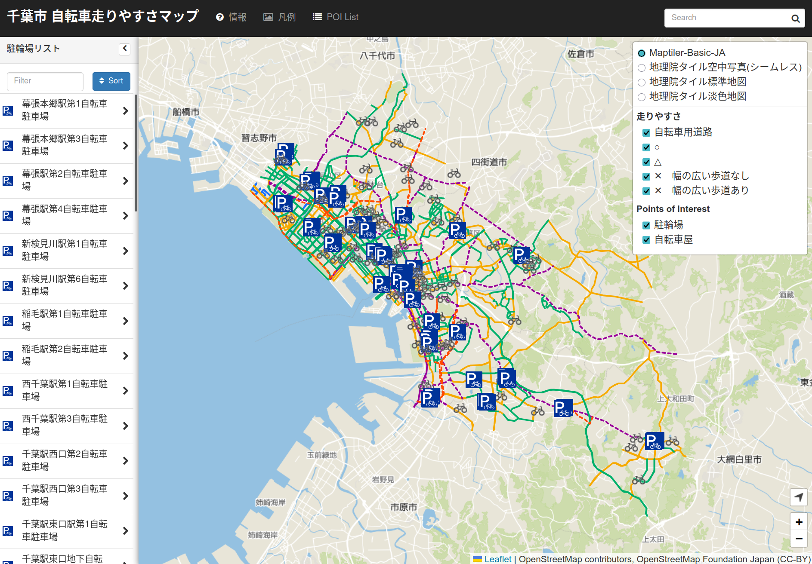
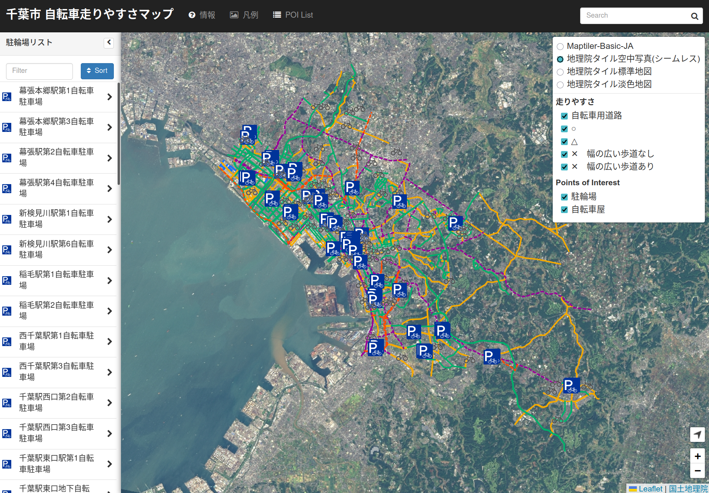

# 千葉市 自転車走りやすさマップ (fork)

千葉市の「[自転車走りやすさマップ](https://www.city.chiba.jp/kensetsu/doro/bicycle/soukoukankyouseibi.html)」をオンライン地図にしたプロジェクト。

リンク切れなどで動かなくなっていた[smellman/chiba_bicyclemap](https://github.com/smellman/chiba_bicyclemap)をフォークして、修正を加えました。元は[BootLeaf](https://github.com/bmcbride/bootleaf)がベースになっています。

## 追加・修正内容

- アプリ名を「千葉市 自転車走りやすさマップ」に変更
- デフォルトのビューポートサイズを全体が映るように修正
- デフォルトの背景地図を[OpenStreetMap Foundation Japanが管理しているmaptiler-basic-ja](https://wiki.openstreetmap.org/wiki/Japan/OSMFJ_Tileserver)に変更
- [国土地理院の航空写真タイル](https://maps.gsi.go.jp/development/ichiran.html#seamlessphoto)を追加
- ラインカラーをユニバーサルデザインカラーに変更
- 駐輪場・自転車店レイヤをデフォルト表示に変更
- POIに駐輪場情報を表示してクリックで移動できるように変更
- ベンダーライブラリをローカルに配置してCDN依存を解消

## スクリーンショット

